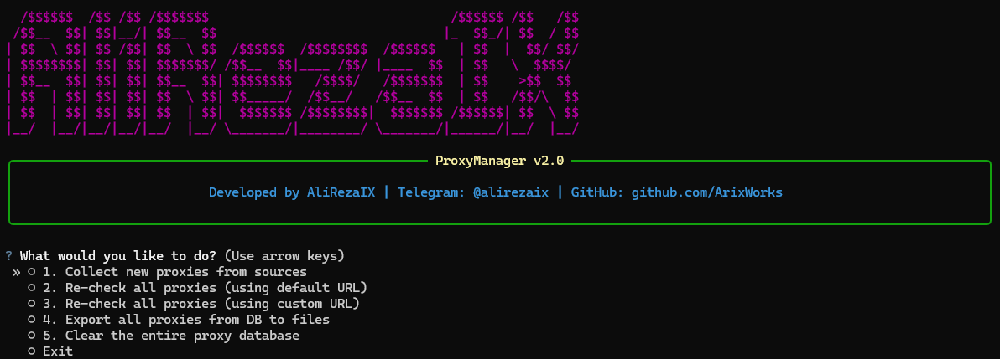
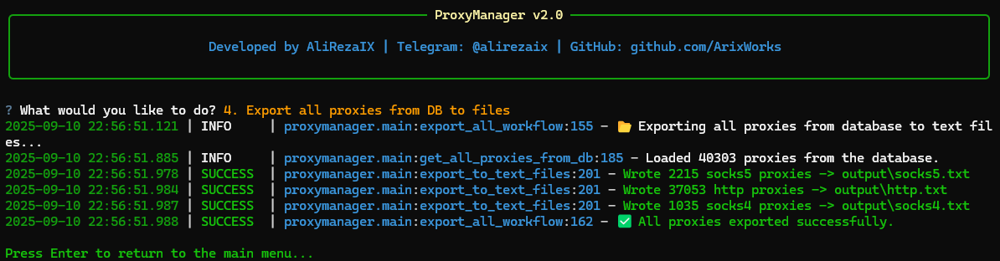

<!-- English Version -->
<div align="center">
  
  <h1>ProxyManager V2</h1>
  <p><strong>An intelligent, asynchronous, and database-driven proxy management tool.</strong></p>
  <p>
    <a href="https://github.com/ArixWorks/ProxyManager/stargazers"></a>
    <a href="https://github.com/ArixWorks/ProxyManager/network/members"></a>
    <a href="https://github.com/ArixWorks/ProxyManager/issues"></a>
    <a href=“https://github.com/ArixWorks/ProxyManager/blob/main/LICENSE”></a>
    
    <br>
    
  </p>
  <p>
    <b><a href="#-persian-version-نسخه-فارسی">Scroll down for Persian Version (برای نسخه فارسی به پایین بروید)</a></b>
  </p>
</div>

---

`ProxyManager` is a powerful command-line tool designed for developers, penetration testers, and data scientists who need a reliable and fast way to manage proxies. It automates the entire lifecycle: collecting from various sources, multi-layered checking, intelligent scoring, and persistent storage in a database.

### ✨ Key Features

*   🚀 **Asynchronous Core:** Built with `asyncio` and `aiohttp` for high-concurrency and blazing-fast performance.
*   📚 **Multi-Source Collection:** Gathers proxies from popular online providers and custom text file URLs.
*   ✅ **Advanced Health Checks:** Tests proxies for TCP connectivity, latency (ms), and download speed (Mbps).
*   📊 **Intelligent Scoring:** Ranks proxies based on a weighted algorithm considering latency, speed, and uptime.
*   💾 **Persistent Database:** Saves all proxy data to an SQLite database, preventing data loss and enabling historical analysis.
*   ⚙️ **Highly Configurable:** Easily tweak settings like concurrency, timeouts, and scoring weights via a simple `config.yaml` file.
*   🖥️ **Interactive CLI Menu:** A user-friendly, menu-driven interface powered by `Typer` and `Questionary` for easy operation.
*    graceful **Graceful Shutdown:** Safely interrupts long tasks (like re-checking) with `Ctrl+C` and saves the results found so far.
*   📤 **Flexible Exporting:** Exports working proxies into clean `http.txt`, `socks4.txt`, `socks5.txt`, and a detailed `proxies.json` file.

### 📸 Screenshots

<div align="center">
  <p><strong>Main Menu Interface</strong></p>
  
  <br/><br/>
  <p><strong>Example Output Files</strong></p>
  
</div>

### 🛠️ Installation & Setup

Follow these steps to get `ProxyManager` up and running.

**1. Clone the repository:**
```bash
git clone https://github.com/ArixWorks/ProxyManager.git
cd ProxyManager
```

**2. Create and activate a virtual environment:**
It is highly recommended to use a virtual environment to avoid conflicts with other projects' dependencies.

*   **On Windows:**
```cmd
python -m venv venv
venv\Scripts\activate
```
*   **On macOS and Linux:**
```bash
python3 -m venv venv
source venv/bin/activate
```

**3. Install the dependencies:**
With your virtual environment activated, run the following command:
```bash
pip install -r requirements.txt
```

### ⚙️ Configuration

Before running, you can customize behavior by editing the `config.yaml` file. Key options include:
*   `concurrency_limit`: Number of proxies to check simultaneously.
*   `http_request_timeout`: Timeout for HTTP requests.
*   `scoring_weights`: Adjust how latency and speed affect the final score.
*   `collector_proxy`: Use a proxy to fetch proxy lists (useful if sources are blocked).

### 🚀 Usage

Run the application to launch the main menu:

```bash
python -m proxymanager.cli
```

This will launch an interactive menu where you can choose from the following options:

1.  **🚀 Run Full Workflow:** Collect, check, score, and export proxies.
2.  **🔄 Re-check All Proxies (Default URL):** Re-validate all proxies in the database.
3.  **🎯 Re-check All Proxies (Custom URL):** Re-validate proxies against a URL you provide.
4.  **📥 Collect New Proxies Only:** Fetch new proxies without checking them.
5.  **💾 Export All Proxies to Files:** Export all proxies currently in the database.
6.  **🔥 DELETE ALL PROXIES:** Clear the entire database. Use with caution!

### 🤝 Contribute & Share Your Ideas!

This project is built for the community! If you have ideas for new features, find a bug, or want to improve the code, please:
*   **Open an Issue:** Share your suggestions or report problems.
*   **Submit a Pull Request:** Fork the repository, make your changes, and create a PR.

### 📞 Contact & Custom Projects

Need a custom version of this tool, a different Python project, or want to collaborate? Feel free to reach out!

*   **Telegram:** **[@alirezaix](https://t.me/alirezaix)**

---
---

<!-- Persian Version -->
<div dir="rtl" align="right">

<hr>

<h1><a name="-persian-version-نسخه-فارسی"></a>ProxyManager V2 (نسخه فارسی)</h1>
<p><strong>یک ابزار هوشمند، غیرهمزمان و مبتنی بر دیتابیس برای مدیریت پروکسی.</strong></p>

`ProxyManager` یک ابزار خط فرمان قدرتمند است که برای توسعه‌دهندگان، متخصصان امنیت و دانشمندان داده طراحی شده که به روشی سریع و قابل اعتماد برای مدیریت پروکسی‌ها نیاز دارند. این ابزار تمام چرخه عمر پروکسی را خودکار می‌کند: جمع‌آوری از منابع مختلف، بررسی چندلایه، امتیازدهی هوشمند و ذخیره‌سازی دائمی در دیتابیس.

### ✨ قابلیت‌های کلیدی

*   🚀 **هسته غیرهمزمان (Asynchronous):** ساخته شده با `asyncio` و `aiohttp` برای همزمانی بالا و عملکرد فوق‌العاده سریع.
*   📚 **جمع‌آوری از چند منبع:** پروکسی‌ها را از ارائه‌دهندگان آنلاین محبوب و فایل‌های متنی با URL دلخواه جمع‌آوری می‌کند.
*   ✅ **بررسی سلامت پیشرفته:** پروکسی‌ها را از نظر اتصال TCP، زمان پاسخ‌دهی (Latency) و سرعت دانلود (Mbps) تست می‌کند.
*   📊 **امتیازدهی هوشمند:** پروکسی‌ها را بر اساس یک الگوریتم وزن‌دار با در نظر گرفتن سرعت، تأخیر و کارایی رتبه‌بندی می‌کند.
*   💾 **دیتابیس پایدار:** تمام داده‌های پروکسی را در یک دیتابیس SQLite ذخیره می‌کند.
*   ⚙️ **قابلیت تنظیم بالا:** به راحتی تنظیماتی مانند تعداد تست همزمان، زمان وقفه و وزن‌های امتیازدهی را از طریق فایل `config.yaml` تغییر دهید.
*   🖥️ **منوی تعاملی CLI:** یک رابط کاربری دوستانه و مبتنی بر منو که با `Typer` و `Questionary` ساخته شده است.
*   graceful **خروج امن:** با فشردن `Ctrl+C`، فرآیندهای طولانی را به صورت امن متوقف کرده و نتایج را ذخیره می‌کند.
*   📤 **خروجی‌های متنوع:** پروکسی‌های فعال را در فایل‌های مجزای `http.txt`, `socks4.txt`, `socks5.txt` و یک فایل کامل `proxies.json` خروجی می‌دهد.

### 📸 تصاویر محیط برنامه

<div align="center">
  <p><strong>رابط منوی اصلی</strong></p>
  
  <br/><br/>
  <p><strong>نمونه فایل‌های خروجی</strong></p>
  
</div>

### 🛠️ نصب و راه‌اندازی

برای نصب و اجرای `ProxyManager` مراحل زیر را دنبال کنید.

**۱. پروژه را کلون کنید:**
```bash
git clone https://github.com/ArixWorks/ProxyManager.git
cd ProxyManager
```

**۲. محیط مجازی را ساخته و فعال کنید:**
استفاده از محیط مجازی به شدت توصیه می‌شود تا وابستگی‌های پروژه با سایر پروژه‌ها تداخل نداشته باشد.

*   **در ویندوز:**
```cmd
python -m venv venv
venv\Scripts\activate
```
*   **در مک و لینوکس:**
```bash
python3 -m venv venv
source venv/bin/activate
```

**۳. وابستگی‌ها را نصب کنید:**
پس از فعال‌سازی محیط مجازی، دستور زیر را اجرا کنید:
```bash
pip install -r requirements.txt
```

### ⚙️ پیکربندی

قبل از اجرا، می‌توانید رفتار برنامه را با ویرایش فایل `config.yaml` شخصی‌سازی کنید. تنظیمات کلیدی عبارتند از:
*   `concurrency_limit`: تعداد پروکسی‌هایی که به صورت همزمان تست می‌شوند.
*   `http_request_timeout`: حداکثر زمان انتظار برای درخواست‌های HTTP.
*   `scoring_weights`: برای تنظیم تأثیر سرعت و تأخیر در امتیاز نهایی.
*   `collector_proxy`: برای استفاده از پروکسی جهت دریافت لیست پروکسی‌ها.

### 🚀 نحوه استفاده

برنامه را با دستور زیر اجرا کنید تا منوی اصلی نمایش داده شود:

```bash
python -m proxymanager.cli
```

این دستور یک منوی تعاملی را اجرا می‌کند که در آن می‌توانید گزینه‌های زیر را انتخاب کنید:

۱. **🚀 اجرای کامل فرآیند:** جمع‌آوری، تست، امتیازدهی و ذخیره خروجی‌ها.
۲. **🔄 تست مجدد همه پروکسی‌ها (URL پیش‌فرض):** اعتبارسنجی مجدد تمام پروکسی‌ها.
۳. **🎯 تست مجدد همه پروکسی‌ها (URL دلخواه):** تست پروکسی‌ها در برابر یک URL دلخواه.
۴. **📥 فقط جمع‌آوری پروکسی‌های جدید:** افزودن پروکسی‌های جدید به دیتابیس بدون تست.
۵. **💾 ذخیره همه پروکسی‌ها در فایل:** خروجی گرفتن از تمام پروکسی‌های موجود در دیتابیس.
۶. **🔥 حذف تمام پروکسی‌ها:** پاک کردن کل دیتابیس. با احتیاط استفاده شود!

### 🤝 مشارکت کنید و ایده‌های خود را به اشتراک بگذارید!

این پروژه برای جامعه کاربری ساخته شده و نظرات شما ارزشمند است! اگر ایده‌ای برای قابلیت‌های جدید دارید یا باگی پیدا کرده‌اید، لطفاً:
*   **یک Issue باز کنید:** پیشنهادات خود را به اشتراک بگذارید.
*   **یک Pull Request ارسال کنید:** پروژه را Fork کرده، تغییرات خود را اعمال کنید و یک PR بسازید.

### 📞 تماس و پروژه‌های سفارشی

اگر به یک نسخه سفارشی از این ابزار، یک پروژه پایتونی دیگر یا همکاری نیاز دارید، با من در ارتباط باشید.

*   **تلگرام:** **[@alirezaix](https://t.me/alirezaix)**

</div>

## Star History

<a href="https://www.star-history.com/#ArixWorks/ProxyManager&Date">
 <picture>
   <source media="(prefers-color-scheme: dark)" srcset="https://api.star-history.com/svg?repos=ArixWorks/ProxyManager&type=Date&theme=dark" />
   <source media="(prefers-color-scheme: light)" srcset="https://api.star-history.com/svg?repos=ArixWorks/ProxyManager&type=Date" />
   
 </picture>
</a>